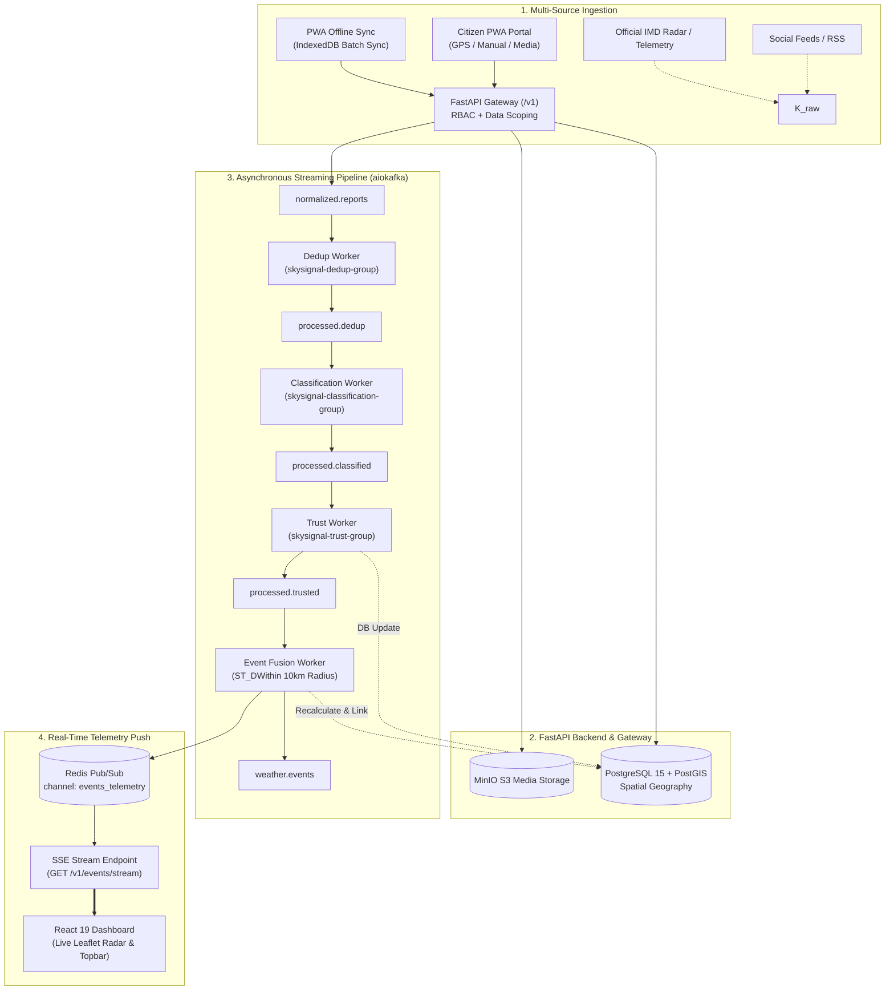

# ⛈️ SkySignal 2.0 — National Weather Intelligence Platform

> **SIH26069** · Ministry of Earth Sciences (MoES) / India Meteorological Department (IMD)  
> Real-Time Multi-Source Meteorological Telemetry Aggregation, Deduplication, and Spatio-Temporal Event Fusion Engine.

[](https://fastapi.tiangolo.com)
[](https://react.dev)
[](https://postgis.net)
[](https://redpanda.com)
[](https://redis.io)
[](https://min.io)
[](#-automated-testing)

---

## 📌 Executive Summary

**SkySignal 2.0** is an enterprise-grade, distributed meteorological intelligence platform designed to ingest raw citizen weather observations, social media signals, and sensor feeds, corroborate them against official IMD data, deduplicate near-identical submissions across space and time, estimate credibility, and fuse them into actionable national weather events in real-time.

Built with strict data scoping and role-based access control (RBAC), the platform delivers a read-only situational awareness dashboard for citizens and a secure, real-time command portal for IMD analysts.

---

## 🏛️ System Architecture



---

## ✨ Key Capabilities

### 1. Citizen Weather Reporting & Offline PWA
- **Zero-Auth Ingestion (`POST /v1/reports`):** Citizens submit weather hazards (rainfall, flooding, thunderstorms, heatwaves, dust storms, fogs, strong winds) with optional photos/videos without needing an account.
- **Anonymous Device Identification:** Session tracking enforced strictly via `X-Device-Id` header.
- **PWA Offline Sync (`POST /v1/reports/batch-sync`):** Reports logged during network outages are cached in client IndexedDB and synced upon reconnection with strict `client_report_id` idempotency.
- **Session History (`GET /v1/reports/mine`):** Device-scoped query displaying previous submissions without leaking personal data.

### 2. High-Performance 4-Stage Kafka Workers
- **Stage 1 (Dedup):** Consumes `normalized.reports`, applies clustering heuristics, and dispatches to `processed.dedup`.
- **Stage 2 (Classification):** Consumes `processed.dedup`, assigns category confidence scores (0.60–0.99), and dispatches to `processed.classified`.
- **Stage 3 (Trust Scoring):** Consumes `processed.classified`, computes misleading risk $P_{\text{misleading}}$ (0.01–0.99), updates PostgreSQL records, and publishes to `processed.trusted`.
- **Stage 4 (Event Fusion):** Consumes `processed.trusted`, runs PostGIS `ST_DWithin` (10km, 6h window), links corroborating reports into canonical `Event` clusters, recalculates multi-source confidence, and publishes to Redis `events_telemetry`.

### 3. Real-Time Telemetry (SSE Stream)
- Protected `GET /v1/events/stream` subscription powered by async Redis Pub/Sub.
- Push-based updates stream directly into the React Leaflet radar map and situational summary cards without client polling.

### 4. Strict Security & Public Data Scoping
- **Public Query Rewriting:** Unauthenticated requests to `GET /v1/events` automatically force `lifecycle_status IN ('confirmed', 'active')` at the database level, preventing disclosure of unverified or internal events.
- **Granular RBAC:** `analyst` and `senior_admin` roles verified via signed HS256 JWT tokens. Sensitive endpoints (verification triage, duplicate review, merge/escalate actions, audit logs) strictly reject unauthorized access.

---

## 🛠️ Technology Stack

| Layer | Technologies |
|---|---|
| **Frontend SPA** | React 19, TypeScript, Vite, Tailwind CSS v4, Lucide Icons, Recharts |
| **Geospatial Mapping** | Leaflet, React-Leaflet, Leaflet MarkerCluster, OpenStreetMap / CartoDB Dark |
| **Backend API** | FastAPI, Uvicorn, Pydantic Settings, AsyncPG |
| **Database & GIS** | PostgreSQL 15, PostGIS 3.3, GeoAlchemy2, SQLAlchemy 2.0 (Async) |
| **Streaming & Pub/Sub**| Apache Kafka / Redpanda (`aiokafka`), Redis 7 Alpine (`redis-py`) |
| **Media Storage** | MinIO (S3-compatible object storage) |
| **Internationalization** | i18next bilingual support (English & हिन्दी) |

---

## 🚀 Getting Started

### Prerequisites
- [Docker & Docker Compose](https://www.docker.com/)
- [Node.js](https://nodejs.org/) (v18.0+)
- [Python](https://www.python.org/) (v3.11+)

---

### Step 1: Start Infrastructure Containers

Spin up PostgreSQL (PostGIS), Redpanda (Kafka), Redis, and MinIO:

```bash
docker compose up -d
```

| Service | Port | Purpose | Credentials |
|---|---|---|---|
| **PostgreSQL + PostGIS** | `5432` | Spatial DB & GeoAlchemy2 | `skygrid` / `skygrid_secret` |
| **Redpanda / Kafka** | `9092` | Message Streaming Broker | (None) |
| **Redis** | `6379` | Telemetry Pub/Sub & Cache | (None) |
| **MinIO API** | `9000` | S3 Media Storage API | `skygrid` / `skygrid_secret` |
| **MinIO Console** | `9001` | Object Storage Web Console | `skygrid` / `skygrid_secret` |

---

### Step 2: Run the FastAPI Backend

```bash
cd backend

# Create virtual environment and install dependencies
python -m venv .venv
source .venv/bin/activate  # On Windows: .venv\Scripts\activate
pip install -r requirements.txt

# Run the API server
uvicorn app.main:app --reload --host 0.0.0.0 --port 8000
```

- **Interactive Swagger Docs:** [http://localhost:8000/docs](http://localhost:8000/docs)
- **ReDoc:** [http://localhost:8000/redoc](http://localhost:8000/redoc)

---

### Step 3: Run the React 19 Frontend

```bash
# In the project root directory
npm install
npm run dev
```

The application will be live at **`http://localhost:5173`**.

---

## 🔑 Demo Analyst Credentials

To access analyst-restricted dashboards (Verification Queue, Duplicate Clusters, Audit Logs, Real-Time SSE Stream):

- **Email:** `analyst@imd.gov.in`
- **Password:** `Analyst@123`
- *Or click "Autofill Demo Analyst" directly in the Topbar Login Modal.*

---

## 📡 Core API Specification

### Public Endpoints (No Auth Required)

| Method | Path | Headers / Params | Description |
|---|---|---|---|
| `POST` | `/v1/reports` | `X-Device-Id` (req), `multipart/form-data` | Ingests report, saves media to MinIO, pushes to `raw.citizen`. |
| `POST` | `/v1/reports/batch-sync` | `X-Device-Id` (req), `application/json` | PWA offline synchronization with `client_report_id` idempotency. |
| `GET` | `/v1/events` | `bbox`, `lat`, `lon`, `radius_km`, `category` | Public event list (forced filter: `confirmed`, `active`). |
| `GET` | `/v1/reports/mine` | `X-Device-Id` (req) | Returns reports submitted by the requesting device session. |

### Analyst / Administrative Endpoints (Admin JWT Required)

| Method | Path | Auth Scheme | Description |
|---|---|---|---|
| `POST` | `/v1/auth/login` | Public (`email`, `password`) | Returns signed 8-hour JWT token with analyst/senior_admin claim. |
| `GET` | `/v1/events/stream` | Bearer Token or `?token=` | Real-time Server-Sent Events (SSE) telemetry push via Redis. |
| `GET` | `/v1/reports/{id}` | Bearer Token (`analyst`) | Full report detail including duplicate clusters and evidence. |
| `POST` | `/v1/reports/{id}/verify` | Bearer Token (`analyst`) | Marks report as verified and triggers lifecycle transition. |
| `POST` | `/v1/events/{id}/merge` | Bearer Token (`analyst`) | Merges duplicate weather events and consolidates reports. |
| `GET` | `/v1/audit-log` | Bearer Token (`analyst`) | Immutable administrative action history and audit records. |

---

## 🧪 Automated Testing

The backend includes a comprehensive, isolated integration and unit test suite verified with Pytest:

```bash
# Run complete test suite (82 passing tests)
pytest backend/tests/ -v
```

```text
======================= 82 passed, 8 warnings in 10.54s =======================
```

- `test_fusion_and_stream.py` (8 tests): PostGIS `ST_DWithin` spatial fusion, Redis Pub/Sub, SSE streaming.
- `test_kafka_workers.py` (11 tests): Dedup, Classification, and Trust Kafka worker pipelines.
- `test_public_endpoints.py` (7 tests): Multipart report submission, MinIO storage, offline batch idempotency.
- `test_security_and_storage.py` (12 tests): Password hashing, JWT cycles, RBAC guards, MinIO upload client.
- `test_health.py` (5 tests): Health probes, CORS configuration, header exposures.
- `test_public_data_scoping.py` (6 tests): Guest status query scoping and existence hiding.
- `test_endpoints_lockdown.py` (21 tests): Comprehensive 401/403 lockdown across operational routes.
- `test_rbac_unit.py` (12 tests): JWT token edge cases, expiry, and role verification.

---

## 📄 License & Attribution

Developed for the **Smart India Hackathon (SIH26069)** under the auspices of the **Ministry of Earth Sciences (MoES)** and the **India Meteorological Department (IMD)**.
