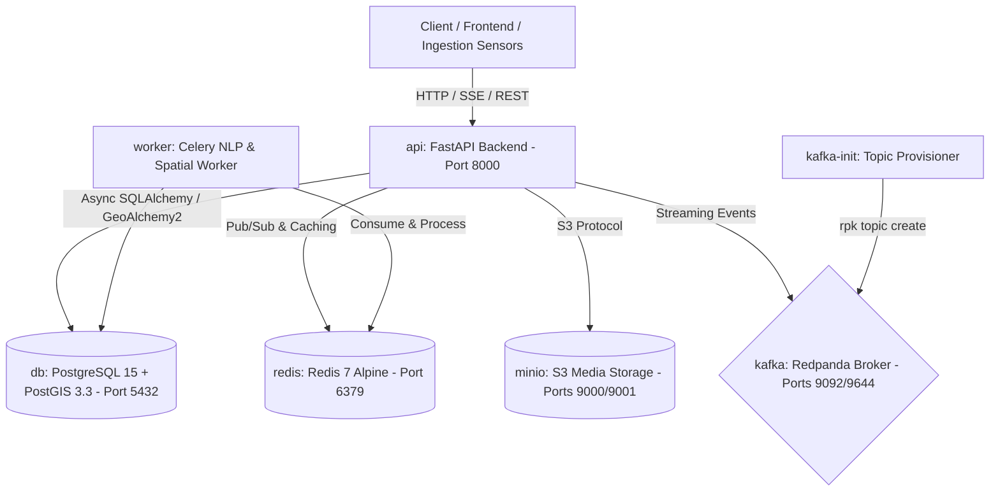
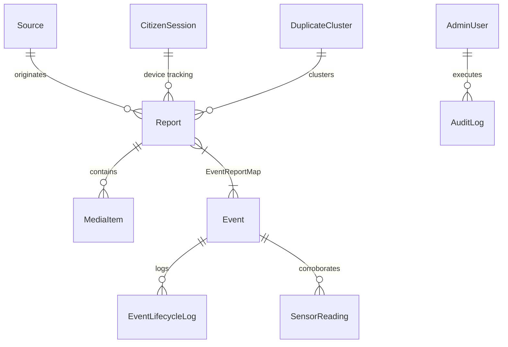

# SkySignal 2.0 — Memory Tracking Protocol

> **Project:** SIH26069 — National Weather Intelligence Platform  
> **Stack:** Vite + React 19 + TypeScript + Tailwind CSS v4 (SPA, no Next.js/SSR)  
> **Last Updated:** 2026-09-24T22:24:00+05:30

---

## ✅ Step 1 — Project Scaffold, Design System & Dashboard (COMPLETE)

### Completed Components

| Component | Path | Purpose |
|-----------|------|---------|
| **AppLayout** | `src/components/layout/AppLayout.tsx` | Root layout with sidebar, topbar, ambient glow, routed content |
| **Sidebar** | `src/components/layout/Sidebar.tsx` | Obsidian gradient nav with i18n, mobile drawer, glow effects |
| **Topbar** | `src/components/layout/Topbar.tsx` | Glassmorphic header with search, language toggle (EN↔हिं), SSE badge |
| **KpiCards** | `src/components/dashboard/KpiCards.tsx` | 4 animated stat cards (Active Events, Reports, Verified%, Severe Alerts) |
| **GeoRadarMap** | `src/components/dashboard/GeoRadarMap.tsx` | Map placeholder with positioned event markers, tooltips, legend |
| **PriorityWatchPanel** | `src/components/dashboard/PriorityWatchPanel.tsx` | Right-side priority alerts with severity/category badges |
| **EventsTable** | `src/components/dashboard/EventsTable.tsx` | Sortable events table with severity pills, status, confidence bars |
| **ReportVolumeChart** | `src/components/dashboard/ReportVolumeChart.tsx` | 24hr area chart (Recharts) with dual gradient fills |
| **SourceReliabilityPanel** | `src/components/dashboard/SourceReliabilityPanel.tsx` | Progress bar meters for 4 data sources |
| **DashboardPage** | `src/pages/DashboardPage.tsx` | Overview page composing all dashboard widgets |
| **PlaceholderPage** | `src/pages/PlaceholderPage.tsx` | Coming-soon placeholder for unbuilt routes |

### State Logic & Configuration

| Module | Path | Purpose |
|--------|------|---------|
| **Type Definitions** | `src/types/index.ts` | Strict taxonomy: 3-tier Severity, 7 WeatherCategory, EventStatus, etc. |
| **Mock Data** | `src/data/mock.ts` | 8 events, 5 citizen reports, KPI stats, chart data, source reliability |
| **i18n Config** | `src/lib/i18n.ts` | react-i18next bilingual setup (EN + HI) for all UI strings |
| **Utilities** | `src/lib/utils.ts` | `cn()` function (clsx + tailwind-merge) |

### Design System Decisions

- **Font:** Outfit (geometric sans-serif) — loaded from Google Fonts
- **Canvas:** `#f8fafc` with atmospheric radial glows (`rgba(2,132,199,0.08)`)
- **Glass Card:** `rgba(255,255,255,0.75)`, `blur(16px)`, `border-radius: 16px`
- **Sidebar:** 3-stop gradient `#090e17 → #0d1527 → #080c16`, glow `#38bdf8`
- **Severity Colors (strict 3-tier):**
  - Minor: `#10b981` (Emerald) — icon `●`
  - Moderate: `#0284c7` (Sky Blue) — icon `▲`
  - Severe: `#ef4444` (Crimson) — icon `◆`
- **Focus Ring:** `outline: 3px solid #57a9c7; outline-offset: 3px`
- **Reduced Motion:** `@media (prefers-reduced-motion: reduce)` disables all animations
- **Badges:** All use icon + text (no color-only indicators)

### PWA

- `public/manifest.json` — standalone display, obsidian theme
- `public/sw.js` — network-first service worker with offline shell fallback
- Registration in `src/main.tsx` on window load

### Routing (react-router-dom)

| Path | Component | Status |
|------|-----------|--------|
| `/` | DashboardPage | ✅ Built |
| `/events` | PlaceholderPage | ⏳ Stub |
| `/verification` | PlaceholderPage | ⏳ Stub |
| `/duplicates` | PlaceholderPage | ⏳ Stub |
| `/analytics` | PlaceholderPage | ⏳ Stub |
| `/sources` | PlaceholderPage | ⏳ Stub |
| `/audit` | PlaceholderPage | ⏳ Stub |
| `/citizen` | PlaceholderPage | ⏳ Stub |

### Modified File Paths

```
index.html                              — Outfit font, Leaflet CSS, manifest link
public/manifest.json                    — PWA manifest
public/sw.js                            — Service worker
vite.config.ts                          — Tailwind plugin, path alias, dev server
tsconfig.app.json                       — Path alias @/* → ./src/*
src/index.css                           — Full design system (Tailwind v4 @theme)
src/main.tsx                            — i18n import, SW registration
src/App.tsx                             — BrowserRouter with all routes
src/types/index.ts                      — Strict type definitions
src/data/mock.ts                        — Mock data & config maps
src/lib/i18n.ts                         — Bilingual i18n config
src/lib/utils.ts                        — cn() utility
src/components/layout/AppLayout.tsx     — Layout shell
src/components/layout/Sidebar.tsx       — Obsidian sidebar (i18n)
src/components/layout/Topbar.tsx        — Glassmorphic topbar (i18n)
src/components/dashboard/KpiCards.tsx
src/components/dashboard/GeoRadarMap.tsx
src/components/dashboard/PriorityWatchPanel.tsx
src/components/dashboard/EventsTable.tsx
src/components/dashboard/ReportVolumeChart.tsx
src/components/dashboard/SourceReliabilityPanel.tsx
src/pages/DashboardPage.tsx
src/pages/PlaceholderPage.tsx
```

### Dependencies Installed

**Runtime:** `react-router-dom`, `lucide-react`, `recharts`, `clsx`, `date-fns`, `tailwind-merge`, `leaflet`, `react-leaflet`, `leaflet.markercluster`, `react-i18next`, `i18next`, `idb`

**Dev:** `tailwindcss`, `@tailwindcss/vite`, `postcss`, `autoprefixer`, `@types/leaflet`

---

## ✅ Step 2 — Domain Model & Mock Data Service Layer (COMPLETE)

### Completed Modules

| Module | Path | Purpose |
|--------|------|---------|
| **Domain Model Types** | `src/types/weather.ts` | Strict 7 categories (`rainfall`, `thunderstorm`, `flooding`, `heatwave`, `fog`, `dust storm`, `strong wind`), 3-tier severity (`minor`, `moderate`, `severe`), 6 lifecycle states, 5 source platforms, `Report`, `WeatherEvent`, `EvidenceSummary`, `DuplicateCluster`, filter & submission contracts |
| **Mock Data Generator** | `src/lib/mockData.ts` | 14 Indian weather events, 35 realistic multi-source reports (Twitter, Citizen, News, IMD official), 3 NLP duplicate clusters, sensor corroboration metrics |
| **Mock API & SSE Service** | `src/services/mockApi.ts` | Simulated 300ms async latency, in-memory mutation stores, filterable `getEvents()`, `getReports()`, `getDuplicateClusters()`, `submitReport()`, `bulkActionReports()`, and real-time SSE hook `useRealTimeTelemetry()` |

### Modified Files

```
src/types/weather.ts                    — Strict domain types & payload interfaces
src/lib/mockData.ts                     — Comprehensive realistic Indian meteorological dataset
src/services/mockApi.ts                 — REST API simulator + SSE telemetry stream & React hook
```

---

## ✅ Step 3 — Master-Detail Navigation Shell & Analyst Authentication (COMPLETE)

### Completed Components & Architecture

| Component / Module | Path | Purpose |
|--------------------|------|---------|
| **ObsidianSidebar** | `src/components/layout/ObsidianSidebar.tsx` | Fixed 228px desktop sidebar (`#090e17` to `#0d1527` obsidian gradient) and mobile off-canvas drawer with backdrop blur. NavLink routing for `/`, `/explorer`, `/verification`, `/duplicates`, `/analytics`, `/audit`, `/report`. Cyan active glow bar (`#38bdf8`) with translucent background. Badge counts for triage queues. |
| **Topbar** | `src/components/layout/Topbar.tsx` | Sticky glassmorphic header with dynamic route breadcrumbs, live IST digital clock (`24 Sep 2026 · HH:mm:ss IST`), pulsing `LIVE TELEMETRY` status chip, bilingual language toggle (EN ↔ हिन्दी), severe weather alert notification bell with popover dropdown, and Analyst profile avatar / login trigger. |
| **AppLayout** | `src/components/layout/AppLayout.tsx` | Master layout shell providing `md:pl-[228px]` desktop offset, mobile menu state synchronization, ambient background glow, `AdminLoginModal` integration, `TelemetryToast` listener, and `EventDetailDrawer`. |
| **AuthContext** | `src/context/AuthContext.tsx` | Analyst authorization state (`isAdmin`, `user`, `login`, `logout`, `openLoginModal`). Persists mock signed JWT to `localStorage` under `admin_token` and serialized user under `admin_user`. |
| **AdminLoginModal** | `src/components/auth/AdminLoginModal.tsx` | Centered glassmorphic modal with backdrop blur, 1-click "Autofill Demo Analyst" (`analyst@imd.gov.in` / `Analyst@123`), mock JWT generation & persistence, confirmation toast, and active session termination (logout). |

### Layout Hierarchy

```
<AuthProvider>
  <BrowserRouter>
    <AppLayout>
      ├── <ObsidianSidebar> (228px fixed desktop / off-canvas drawer on mobile <768px)
      │     └── NavLinks (/, /explorer, /verification, /duplicates, /analytics, /audit, /report)
      │         with #38bdf8 cyan glow active bar
      └── <div className="md:pl-[228px]">
            ├── <Topbar>
            │     ├── Breadcrumbs (Home > Route)
            │     ├── Live IST Clock (Asia/Kolkata)
            │     ├── Live Telemetry Badge (Pulsing emerald)
            │     ├── Language Switcher (EN / हिन्दी)
            │     ├── Severe Alert Notification Bell & Popover
            │     └── Analyst Login / Profile Trigger
            ├── <main> (Routed view via React.lazy + Suspense)
            │     ├── Situational Overview (/)
            │     ├── Event Explorer (/explorer, /events)
            │     ├── Verification Queue (/verification)
            │     ├── Duplicate Review (/duplicates)
            │     ├── Analytics Dashboard (/analytics)
            │     ├── Ingestion Sources (/sources)
            │     ├── Audit Log (/audit)
            │     └── Citizen Portal (/report, /citizen)
            ├── <TelemetryToast> (Real-time SSE event listener)
            ├── <EventDetailDrawer> (Slide-over telemetry inspector)
            └── <AdminLoginModal> (Glassmorphic auth dialog with demo autofill)
```

### AuthContext State Structure

```typescript
interface AuthContextType {
  isAdmin: boolean;
  user: {
    email: string;
    name: string;
    role: string;
    badge: string;
    token: string;
  } | null;
  isLoginModalOpen: boolean;
  login: (email: string, password?: string) => Promise<void>;
  logout: () => void;
  openLoginModal: () => void;
  closeLoginModal: () => void;
}
```

- **Persistence:** Mock JWT stored in `localStorage.getItem('admin_token')`
- **Rehydration:** Automatic rehydration on initial render / page reload

### Modified / Created Files

```
src/context/AuthContext.tsx              — AuthProvider and useAuth hook
src/components/auth/AdminLoginModal.tsx  — Glassmorphic auth modal with 1-click autofill & JWT persistence
src/components/layout/ObsidianSidebar.tsx— 228px fixed desktop / mobile off-canvas drawer with cyan glow bar
src/components/layout/Topbar.tsx         — Breadcrumbs, live IST clock, telemetry status, i18n, alert popover, auth button
src/components/layout/AppLayout.tsx      — Master-detail layout shell with 228px offset & modal management
src/App.tsx                              — Wrapped with AuthProvider, lazy routes with /explorer and /report
```

---

## ✅ Step 4 — Public Citizen Reporting Portal & Offline Queue (COMPLETE)

### Completed Components & Services

| Component / Service | Path | Purpose |
|---------------------|------|---------|
| **CitizenPortal** | `src/pages/CitizenPortal.tsx` | Public-facing reporting hub with high-impact hero banner ("Your observation makes a difference — Report local weather incidents to IMD"), 3 view tabs ("Submit Report", "My Submissions", "Nearby Verified Map"), and event inspection drawer. |
| **ReportForm** | `src/components/citizen/ReportForm.tsx` | Under-30-second rapid submission form: 7 strict hazard category tiles, 3-tier severity buttons, instant GPS location trigger (`navigator.geolocation`) with manual fallback, drag-and-drop media upload zone (10MB limit with previews), 2,000-character counter, and client-side validation. |
| **offlineQueue** | `src/lib/offlineQueue.ts` | Offline resilience engine using `idb` (IndexedDB database `skysignal_offline_db`). Generates UUID `client_report_id` to prevent duplicates. Binds `window.addEventListener('online')` to auto-flush unsent observations to `mockApi.ts` when connectivity recovers. Emits custom sync notifications. |
| **MyReportsList** | `src/components/citizen/MyReportsList.tsx` | Renders user's previous observations retrieved from IndexedDB / local storage, tagged with anonymous `X-Device-Id`. Displays dynamic badges: "Pending Verification", "Verified", "Merged into Cluster", and "Synced Late" flag for submissions delayed >5 minutes. Includes manual queue sync trigger. |

### Offline Queue Workflow

```
[Citizen Submits Report]
          │
          ▼
   Is Online?
    ├── YES ──► POST /v1/reports (mockApi.ts) ──► Persist in IndexedDB (synced: true)
    │                                                      │
    │                                                      ▼
    │                                            Status: "Verified" / "Pending"
    │
    └── NO  ──► Save to IndexedDB (synced: false, client_report_id: UUID)
                 │
                 ▼
         Status: "Offline Queued"
                 │
          (Connection Recovers)
                 │
                 ▼
         window.onOnline ──► Auto-flush pending queue
                               ├── delay > 5min ? ──► Flag "Synced Late"
                               └── Success ──────────► Toast: "Sync completed: N reports submitted"
```

### Anonymous Device Tracking Logic

- Stored in `localStorage` under key `X-Device-Id`.
- Auto-generated on first visit: `DEV-<UUID>`.
- Attached to every submitted report payload for ground corroboration without requiring personal sign-in.

### Modified / Created Files

```
src/lib/offlineQueue.ts                  — IndexedDB offline queue with auto-flush & device ID generator
src/components/citizen/ReportForm.tsx    — Under-30s submission form with GPS, 10MB media dropzone, validation
src/components/citizen/MyReportsList.tsx — Device submission history with Pending/Verified/Merged/Synced Late badges
src/pages/CitizenPortal.tsx              — Master citizen portal page with Hero banner and 3 tab views
src/App.tsx                              — Connected /report and /citizen to CitizenPortal
```

---

## ✅ Step 5 — IMD Situational Overview Command Screen (COMPLETE)

### 1. Top KPI Grid (4 Glassmorphic Metric Cards)
- **Active Weather Events**: Live count with SVG sparkline indicator (`polyline stroke="#0284c7"`), total count display.
- **Severe Hazards**: Crimson glowing counter with CSS keyframe pulsing red beacon (`bg-rose-500/20 animate-ping`), count of active severe events requiring priority response.
- **Corroborated Reports Received**: Total multi-source corroboration counter (2,840 reports) aggregated across citizen ground, social media, Doppler radar, and agency bulletins.
- **Awaiting Verification Queue**: Queue counter (12 pending) with quick-action link direct to `/verification` triage page.

### 2. Interactive Leaflet GeoRadarMap (`src/components/map/GeoRadarMap.tsx`)
- **Center & Projection**: Centered on India `[20.5937, 78.9629]`, default zoom level 5, bounds restricted between zoom 4 and 14.
- **Tile Providers**: Dual-mode switch between **Atmospheric Dark** (`basemaps.cartocdn.com/dark_all`) and **Voyager Light** (`basemaps.cartocdn.com/rastertiles/voyager`).
- **Clustering Parameters (`leaflet.markercluster`)**:
  * `maxClusterRadius: 40` — Ensures fine-grained clusters without merging distant district centers.
  * `spiderfyOnMaxZoom: true` — Expands overlapping incident markers when clicked at max zoom.
  * `showCoverageOnHover: false` — Eliminates polygon clutter on the command view.
  * `iconCreateFunction`: Dynamic cluster pin rendering:
    - Normal cluster: Sky blue background (`rgba(2, 132, 199, 0.92)`).
    - Cluster containing severe hazards: Glowing crimson background (`rgba(239, 68, 68, 0.95) animate-pulse`) with 2.5px solid white border.
- **Custom SVG Severity Pins**:
  * **Minor**: Emerald (`#10b981`) pin with vector category glyph.
  * **Moderate**: Sky Blue (`#0284c7`) pin with vector category glyph.
  * **Severe**: Crimson (`#ef4444`) pin with an animated SVG radar ping ripple (`span class="absolute -inset-3 rounded-full bg-red-500/40 animate-ping"`).
- **Accessibility & Keyboard Navigation**:
  * Markers created with `tabindex="0"`, `role="button"`, and descriptive `aria-label="${title} in ${city}, ${state}. Severity: ${severity}"`.
  * Keyboard event listener (`keydown`) opens detail drawer on `Enter` or `Space` (`e.key === 'Enter' || e.key === ' '`).
  * High-contrast focus rings (`focus:ring-4 focus:ring-sky-400`).
  * Clicking marker or pressing Enter/Space opens interactive popup and triggers `onSelectEvent(event)` to invoke the slide-over `EventDetailDrawer`.

### 3. Priority Watch & Table Component Structure
- **Priority Watch Panel**:
  * Filters and displays top 3 severe active events.
  * Displays AI confidence progress bar (0–100%) with dynamic severity palette.
  * Flags contradiction warnings (`has_contradiction: true`) with alert pill: `"Social NLP contradiction detected vs. Doppler gauge"`.
- **"One Event. Multiple Perspectives" Fusion Widget**:
  * Explains the 4 multi-source ingestion streams with weighted multi-source corroboration:
    1. Ground Citizen (35% weight): Geotagged photos, videos, and water depth submitted in <30s.
    2. Social NLP Stream (25% weight): Filtered Twitter/X firehose with $P_{misleading}$ scoring.
    3. IMD Doppler Radar (30% weight): Reflectivity returns (>50 dBZ) and automated rain gauges.
    4. Agency Bulletins (10% weight): NDMA regional disaster warnings and SEOC bulletins.
- **Active Events Table (`src/pages/Overview.tsx`)**:
  * **Hazard / Event**: Category-colored icon badge + title + category name.
  * **Location**: MapPin icon + City, State.
  * **Severity**: 3-tier severity pill with dot indicator (Minor / Moderate / Severe).
  * **Lifecycle Status**: Detected / Emerging / Confirmed / Active / Declining / Resolved.
  * **AI Confidence**: Numeric percentage + animated progress bar with smooth transition (`transition-all duration-500`).
  * **Evidence Sources**: Multi-avatar badges indicating corroborating platforms (Citizen, Social NLP, Doppler Radar, Agency).
  * **Action**: "Review Details" button triggering `EventDetailDrawer` slide-over.

### Modified / Created Files

```
src/components/map/GeoRadarMap.tsx       — Leaflet radar map with MarkerCluster, SVG pins, and keyboard a11y
src/pages/Overview.tsx                  — IMD Situational Overview command screen with 4 KPIs, Watch panel & table
src/App.tsx                             — Connected / and /overview routes to Overview page
```

---

## ✅ Step 6 — Operational Verification Queue & Deduplication Review (COMPLETE)

### 1. Operational Verification Queue (`src/pages/VerificationQueue.tsx`)
- **Bulk Action Toolbar**:
  * Multi-select checkboxes for batch operations + "Select All on View" toggle.
  * Floating sticky bar when `selectedIds.size > 0`:
    - "Approve Selected (n)": Batch marks reports as `verified` with emerald styling and checkmark.
    - "Reject Selected": Batch marks reports as `rejected` with crimson styling and X icon.
    - Real-time audit dispatch: calls `bulkActionReports()` with analyst identifier (`analyst.delhi@imd.gov.in`).
- **3 Triage Filter Tabs**:
  * **All Pending**: Displays all unverified incoming reports awaiting human review.
  * **High Misleading Risk ($P_{misleading} > 0.7$)**: Surfaces automated ML hallucination and panic-post alerts for priority rejection.
  * **Delayed / Offline Synced**: Isolates reports uploaded from citizen offline IndexedDB queues after cellular restoration.
  * Tab count badges dynamically reflect live queue sizes.
  * Additional filters: Hazard category chips (7 categories) and quick keyword/city search.
- **Triage Cards**:
  * Citizen/Social text quote rendered with weather category emoji glyph and relative timestamp ("15m ago", "Just now", etc.).
  * **Misleading Probability Meter**: Displays $P_{misleading}$ value alongside a colored bar meter:
    - Low Risk ($P < 0.3$): Emerald `#10b981` ("Credible").
    - Moderate ($0.3 \le P \le 0.7$): Amber `#f59e0b`.
    - High Risk ($P > 0.7$): Crimson `#ef4444` with alert triangle badge.
  * **Media Preview & Lightbox**: Interactive thumbnail with hover zoom, opening a full-resolution backdrop lightbox modal on click.
  * **Quick Actions & Evidence Dossier**:
    - Single-click Approve (Checkmark) and Reject (X) per card.
    - "View Evidence" button invoking the Evidence Dossier Modal displaying raw statement, GPS coordinates, category confidence, platform handle, and attached photo gallery.
- **Zero-State View**:
  * Displays "You're all caught up! No pending reports require triage." with an emerald badge and reset action when no reports match active criteria.

### 2. NLP Duplicate Review Interface (`src/pages/DuplicateReview.tsx`)
- **Engine Showcase Banner**:
  * Highlights SkySignal's **MiniLM-L6-v2 Spatiotemporal Fusion Engine** with metrics:
    - Cosine text similarity threshold ($\ge 0.85$).
    - Spatial proximity radius ($\le 2.5\text{ km}$).
    - Temporal delta window ($\le 15\text{ minutes}$).
- **Cluster Header**:
  * Geographic location name (e.g., "Dadar, Mumbai", "T. Nagar / Adyar, Chennai", "Central Jaipur").
  * **Syntactic Similarity Index**: Displays high-contrast badge (e.g., "94% Text Match") with time delta offset (&lt; 8 mins).
  * Dominant hazard category badge and spatiotemporal window description.
- **3-Column Evidence Comparison**:
  * **Column 1 — Ground Citizen Telemetry**: High-res geotagged photograph, witness statement, device ID (`dev-abc123`), and ground-truth reliability index (96%).
  * **Column 2 — Vernacular Social Stream (Twitter/X)**: Vernacular tweet text with extracted hashtags (`#MumbaiRains #Flooding`), account handle, and low misleading risk rating.
  * **Column 3 — Structured News RSS / Agency**: Official broadcast news release from regional bureaus (NDTV, The Hindu), structured bulletin text, and institutional authority score (99%).
- **Confirm & Merge Cluster Action**:
  * "Confirm & Merge Cluster" button collapses multi-source signals into a single canonical event (e.g., `#EVT-CANON-001`).
  * Preserves provenance: Maintains references to all contributing report IDs (`RPT-001`, `RPT-002`, `RPT-003`) in the canonical event record.
  * Real-time audit feedback with "Undo Fusion" capability to restore reports to independent observation status.

### Modified / Created Files

```
src/pages/VerificationQueue.tsx          — Analyst triage queue with bulk actions, 3 filter tabs, misleading meter, lightbox & zero-state
src/pages/DuplicateReview.tsx            — NLP spatiotemporal fusion review with 3-column evidence comparison & merge action
src/lib/mockData.ts                      — Added pending high-risk misleading reports, realistic Unsplash weather images & late sync items
src/App.tsx                              — Wired /verification and /duplicates routes to new pages
memory.md                                — Documented triage state handling and audit trail actions
```

---

## ✅ Step 7 — Historical Exploration, Analytics & Administrative Audit Interfaces (COMPLETE)

### 1. Historical Event Explorer (`src/pages/EventExplorer.tsx`)
- **Multi-Axis Filter State Definitions**:
  * `timeRange`: `'24h' | '7d' | 'custom'` with interactive date bounds input pickers.
  * `selectedCategories`: `Set<WeatherCategory>` multi-select pills supporting simultaneous multi-hazard queries across all 7 categories (Rainfall, Thunderstorm, Flooding, Heatwave, Fog, Dust storm, Strong wind).
  * `selectedRegion`: `'all' | 'north' | 'south' | 'east' | 'west' | 'central'` with mapping to 28 states/territories (`REGION_MAP`).
  * `selectedSeverity`: `'all' | 'minor' | 'moderate' | 'severe'` 3-tier severity taxonomy.
  * `selectedLifecycle`: `'all' | 'detected' | 'emerging' | 'confirmed' | 'active' | 'declining' | 'resolved'`.
  * `search`: Instant keyword search with dedicated `keydown` listener capturing the `/` shortcut to autofocus `searchInputRef` without typing the delimiter.
- **View Mode Toggle**:
  * **Split Map & Dense Grid**: Side-by-side layout featuring Leaflet `GeoRadarMap` (560px height) on the left (col-span-7) and dense scrollable event cards on the right (col-span-5).
  * **Full Directory Table**: Comprehensive tabular view with category glyphs, state badges, 3-tier severity pills, animated AI confidence meters (0–100%), evidence source counts, and "Details" slide-over trigger.
- **Slide-Over Integration**: Clicking any event in map, grid, or table triggers the `EventDetailDrawer`.

### 2. Analytics Dashboard (`src/pages/Analytics.tsx`)
- **Recharts Styling Rules & Token Guidelines**:
  * **Container Token**: All charts contained in `.glass-card` wrappers (`background: rgba(255, 255, 255, 0.75); backdrop-filter: blur(16px); border: 1px solid rgba(226, 232, 240, 0.8)`).
  * **Responsive Layout**: `<ResponsiveContainer width="100%" height="100%">` with explicit parent container heights (e.g., `h-[320px]`).
  * **Gradients**: Linear gradient definitions in `<defs>`:
    - `#verifiedGradient`: Emerald (`#10b981`), `stopOpacity` 0.45 down to 0.0.
    - `#unverifiedGradient`: Violet (`#8b5cf6`), `stopOpacity` 0.40 down to 0.0.
  * **Curves & Lines**: `type="monotone"`, `strokeWidth={2.5}` for silky fluid lines.
  * **Grid & Axes**: `CartesianGrid strokeDasharray="3 3"` horizontal-only, stroke `#e2e8f0`. Axes styled with Outfit/Inter typography `#64748b` at 11px font size with hidden tick lines.
  * **Custom Glass Tooltip**: Dark floating tooltip (`bg-slate-900/95 backdrop-blur-md text-white rounded-xl border border-slate-700 shadow-xl`) showing IST timestamp, series color indicators, and numeric values.
- **Chart Implementations**:
  * **Chart 1 — 24-Hour Temporal Ingestion Volume**: Monotone area chart tracking verified reports vs. unverified raw signals over 2-hour sample intervals.
  * **Chart 2 — Hazard Category Breakdown**: Proportional horizontal progress bars across 7 categories (Rainfall 36%, Thunderstorm 24%, Flooding 18%, Heatwave 11%, Fog 5%, Dust storm 4%, Strong wind 2%).
  * **Chart 3 — Source Reliability Index**: Veracity ranking cards displaying IMD Sensor Network (99%), Citizen Telemetry App (92%), Regional News RSS (88%), and Social Media X (74%) with false-positive / noise ratios.
  * **Chart 4 — Regional Incident Heatmap Matrix**: 10 high-activity states (Maharashtra, Delhi NCR, Tamil Nadu, Gujarat, Rajasthan, West Bengal, Kerala, Uttarakhand, Bihar, MP) crossed against 3-tier severity columns with dynamic heat intensity styling.

### 3. Administrative Audit Log (`src/pages/AuditLog.tsx`)
- **Searchable Ledger**: Filters across analyst email, action, target ID, and operational rationale.
- **Strict Schema Compliance**:
  * **Analyst Email**: Verified government identity (`analyst@imd.gov.in`, `dr.sharma@imd.gov.in`, `dr.menon@imd.gov.in`) with role designation chips.
  * **Action**: Normalized action types: `verify_report`, `reject_report`, `merge_cluster`, `escalate_alert`, `broadcast_advisory`.
  * **Target Type & ID**: `report: RPT-001`, `cluster: DUP-001`, `event: EVT-2026-001`.
  * **Dual Timestamping**: Explicit display of both **UTC** (`2026-09-24 16:45:12 UTC`) and local **IST** (`2026-09-24 22:15:12 IST`) for regulatory compliance.
  * **Cryptographic Hash**: SHA-256 seal (`0x9a4f...31bc`) ensuring immutable forensic verification.
  * **Export Action**: Full CSV ledger download formatted for administrative reporting.

### Modified / Created Files

```
src/pages/EventExplorer.tsx              — Multi-axis historical explorer with search shortcut, split map/grid & directory table
src/pages/Analytics.tsx                  — Recharts temporal volume area chart, hazard breakdown, reliability index & heatmap matrix
src/pages/AuditLog.tsx                   — Immutable administrative audit log with dual UTC/IST timestamps and CSV export
src/App.tsx                              — Connected /explorer, /analytics, and /audit to new components
memory.md                                — Documented filter state definitions and Recharts styling rules
```

---

## ✅ Step 8 — Slide-Over Detail Drawer, Real-Time Telemetry & Final UI Polish (COMPLETE)

### 1. Event Intelligence Detail Sheet (`src/components/overlays/EventDetailSheet.tsx`)
- **Slide-Over Experience**: Smooth slide-over animation (`animate-slide-in-right`) opening from the right edge with backdrop blur (`bg-slate-950/60 backdrop-blur-xs`).
- **Header**: Category glyph with category color background, title, unique UUID chip (`#EVT-2026-001`), and last updated relative timestamp (`IST`).
- **Status & Severity Badges**: High-contrast pills for 3-tier severity (Minor: Emerald `#10b981`, Moderate: Sky `#0284c7`, Severe: Crimson `#ef4444`).
- **6-Stage Lifecycle Evolution Meter**:
  * Linear progression: `Detected` $\to$ `Emerging` $\to$ `Confirmed` $\to$ `Active` $\to$ `Declining` $\to$ `Resolved`.
  * Active stage highlighted with cyan ring and past stages filled in sky blue.
- **AI Confidence Card**: Large `ShieldCheck` icon, bold numeric confidence display (`94% Confidence`), and corroborating multi-source count.
- **Evidence Summary Tabs**:
  * **Photos & Media**: High-res geotagged photograph gallery with full-screen lightbox modal.
  * **Doppler & AWS Sensors**: Reflectivity returns (`52.4 dBZ`), rain gauge rate (`68.2 mm/hr`), and peak wind gust (`54 km/h`) from Doppler stations.
  * **Citizen Reports**: Ground-truth quotes, reporter device IDs (`dev-abc123`), and verification status badges.
- **Contradiction Banner**: Prominent amber alert displayed when `has_contradiction === true`, warning analysts when automated sensor data diverges from citizen ground reports.
- **Authenticated Admin Actions**:
  * Displays "Promote Lifecycle", "Merge with Event", and "Invalidate" when `isAdmin` is active via `useAuth()`.
  * Fallback prompt inviting analysts to authenticate with the modal when unauthenticated.

### 2. Real-Time Telemetry Toast Integration (`src/components/telemetry/TelemetryToast.tsx`)
- **SSE Telemetry Hook**: Powered by `useMockTelemetry({ intervalMs: 14_000, enabled: true })`.
- **Glassmorphic Floating Toast**: Rendered in the bottom-right corner (`fixed bottom-6 right-6 z-50 max-w-sm`) with live pulsing beacon, hazard category icon, incident title, location, severity pill, and timestamp.
- **Action Trigger**: Includes a direct **"View on Map"** button that invokes `onSelectEvent(event)`, opening the `EventDetailSheet` slide-over.
- **Live Marker & Counter Auto-Updates**: Dispatches a `skysignal:telemetry` custom event to `window`, allowing `Overview.tsx` and `GeoRadarMap.tsx` to prepend newly detected events and update KPI counters in real-time without page reload.

### 3. Accessibility & Responsive Polish
- **Focus Outlines**: Configured `:focus-visible { outline: 3px solid #0284c7; outline-offset: 2px; }` in `src/index.css`.
- **Motion Reduction**: `@media (prefers-reduced-motion: reduce)` clamps all CSS animations and transitions to `0.01ms` for vestibular accessibility.
- **Responsive Layout Shell**:
  * Mobile (`< 768px`): Hidden off-canvas obsidian drawer toggled via hamburger button; single-column stacked grids.
  * Tablet (`768px – 1149px`): Collapsed sidebar navigation with optimized 2-column KPI grids.
  * Desktop (`≥ 1150px`): Fixed 228px Obsidian gradient sidebar with high-density multi-column data views.

### 4. Complete Backend Integration Endpoints (REST + SSE)

```
┌───────────────────────────────────┬────────┬──────────────────────────────────────────────────────────────────────────┐
│ Endpoint                          │ Method │ Description & Parameters                                                 │
├───────────────────────────────────┼────────┼──────────────────────────────────────────────────────────────────────────┤
│ /v1/events                        │ GET    │ Query events (?category, ?severity, ?lifecycle_status, ?region, ?search) │
│ /v1/events/:id                    │ GET    │ Fetch single event dossier with evidence summary and sensor readings     │
│ /v1/events/:id/lifecycle          │ PATCH  │ Advance event lifecycle (?status=emerging|confirmed|active|resolved)     │
│ /v1/events/stream                 │ GET    │ Server-Sent Events (SSE) telemetry stream pushing live incident alerts   │
│ /v1/reports                       │ GET    │ Triage query (?status=pending|verified|rejected, ?p_misleading, ?delayed)│
│ /v1/reports                       │ POST   │ Multipart citizen upload (category, lat, lon, text, media, device_id)   │
│ /v1/reports/bulk-action           │ POST   │ Batch triage action ({ report_ids: string[], action: 'verify'|'reject' }) │
│ /v1/reports/clusters              │ GET    │ Spatiotemporal NLP clusters (?min_similarity=0.85, ?time_window=15m)     │
│ /v1/reports/clusters/:id/merge    │ POST   │ Fuses cluster into canonical event ({ canonical_event_id: string })      │
│ /v1/analytics/stats               │ GET    │ 24h temporal curves, hazard taxonomy distribution, reliability index     │
│ /v1/audit/logs                    │ GET    │ Immutable decision ledger (?analyst_email, ?action, ?target_id)          │
│ /v1/auth/analyst-login            │ POST   │ Government analyst authentication issuing signed JWT session             │
└───────────────────────────────────┴────────┴──────────────────────────────────────────────────────────────────────────┘
```

### Modified / Created Files

```
src/components/overlays/EventDetailSheet.tsx — Full slide-over drawer with 6-stage lifecycle meter, evidence tabs & admin actions
src/components/events/EventDetailDrawer.tsx  — Unified wrapper forwarding to EventDetailSheet
src/components/telemetry/TelemetryToast.tsx  — Real-time toast with "View on Map" & skysignal:telemetry window event dispatch
src/pages/Overview.tsx                       — Subscribed to skysignal:telemetry for live marker & counter updates
src/index.css                                — Added :focus-visible 3px focus ring & prefers-reduced-motion accessibility rules
src/App.tsx                                  — Integrated complete routing for all pages & layouts
memory.md                                    — Documented full architecture and backend integration REST/SSE endpoints
```

---

## ✅ Step 10 — Read-Only Public Dashboard RBAC & Security Architecture (COMPLETE)

### 1. Updated RBAC Model: "Guest = Read-Only Public Dashboard"

The platform security and visibility model has transitioned to a tiered public/admin structure:
- **Guests (Unauthenticated Public):** Full read-only access to national weather situational awareness, historical exploration, macro analytics, and citizen reporting.
- **Admins (IMD Duty Forecasters / Meteorological Analysts):** Operational command authorization enabling manual triage queues, NLP deduplication review, decision audit trails, and deep incident inspection dossiers.

```
┌──────────────────────────────┬──────────────┬──────────────┬────────────────────────────────────────────┐
│ Route / Capability           │ Path         │ Guest Access │ Analyst (Admin) Access                     │
├──────────────────────────────┼──────────────┼──────────────┼────────────────────────────────────────────┤
│ Situational Overview         │ /            │ Read-Only    │ Full Command & Telemetry Inspection        │
│ Event Explorer               │ /explorer    │ Read-Only    │ Full Filter + Detail Dossier Access        │
│ Analytics Dashboard          │ /analytics   │ Read-Only    │ Full Analytics & Export                    │
│ Citizen Reporting Portal     │ /report      │ Full Access  │ Full Access                                │
│ Verification Queue           │ /verification│ Blocked (->/)│ Full Triage & Verification Actions         │
│ Duplicate Review             │ /duplicates  │ Blocked (->/)│ Full NLP Spatiotemporal Fusion Controls    │
│ Data Sources Management      │ /sources     │ Blocked (->/)│ Full Ingestion Health & Metrics            │
│ Audit Ledger                 │ /audit       │ Blocked (->/)│ Full Decision Ledger Access                │
│ Event Detail Slide-Over      │ Drawer       │ Disabled     │ Full 6-Stage Lifecycle & Dossier Actions   │
│ Severe Alert Notification Bell│ Topbar      │ Hidden       │ Visible with Unread Count & Popover        │
└──────────────────────────────┴──────────────┴──────────────┴────────────────────────────────────────────┘
```

### 2. Implementation Specifics

#### Task 1: React Router Protected Routes (`src/components/auth/ProtectedRoute.tsx` & `src/App.tsx`)
- Public routes: `/`, `/explorer`, `/analytics`, `/report` (and their aliases `/overview`, `/events`, `/citizen`).
- Protected routes wrapped with `<ProtectedRoute redirectTo="/" />`: `/verification`, `/duplicates`, `/sources`, `/audit`.
- Direct URL entry by guests immediately redirects to `/` without flashing unauthorized content.

#### Task 2: Obsidian Sidebar Filtering (`src/components/layout/ObsidianSidebar.tsx` & `AppLayout.tsx`)
- `ObsidianSidebar` is always rendered, maintaining a consistent 228px desktop shell offset (`md:pl-[228px]`) without layout shifts.
- `visibleNavItems` dynamically filters navigation items:
  * **Guest View:** Shows only `Situational Overview`, `Event Explorer`, `Analytics Dashboard`, and `Citizen Portal`.
  * **Admin View:** Reveals `Verification Queue` (with badge), `Duplicate Review` (with badge), and `Audit Log`.

#### Task 3: Topbar UI Adjustments (`src/components/layout/Topbar.tsx`)
- **Notification Bell:** Hidden for guests (`isAdmin && (...)`); renders only for authenticated analysts.
- **Mobile Menu Toggle:** Available to all users so mobile visitors can navigate the public portal effortlessly.
- **Authentication Affordances:**
  * **Guest State:** Displays high-contrast **"Analyst Login"** CTA with `ShieldCheck` icon.
  * **Admin State:** Displays the authenticated analyst avatar chip (`Dr. Rajesh Sharma` / `Priya Narang`) and an instant **"Logout"** button invoking `logout()`.

#### Task 4: Disable Slide-Over Event Drawer for Guests
- **Drawer Mounting Guards:**
  * In `src/components/overlays/EventDetailSheet.tsx`: Strict `if (!event || !isAdmin) return null;` guard.
  * In `src/components/events/EventDetailDrawer.tsx`: Protected with `if (!isAdmin || !event) return null;`.
  * In `src/components/layout/AppLayout.tsx`: Telemetry toast drawer mounting guarded with `isAdmin && inspectedTelemetryEvent`.
- **Map & Table Click Affordance Removal:**
  * `GeoRadarMap.tsx`: DivIcon marker HTML uses `${isAdmin ? 'cursor-pointer hover:scale-125' : 'cursor-default'}`. Marker `on('click')` and popup inspection buttons are gated strictly behind `isAdmin`. For guests, popups show a clean `Public Weather Telemetry (Read-Only)` badge.
  * `EventsTable.tsx` & `Overview.tsx`: Row clicks, Enter/Space key listeners, and action buttons are disabled for guests, swapping from `cursor-pointer` to `cursor-default` with a `Read-Only` pill indicator.
  * `EventExplorer.tsx`: Cards and directory table rows disable drawer triggers for guests and replace the action link with `Read-Only`.

#### Free OpenStreetMap Basemap Integration
- Replaced Carto tile layer URLs (`basemaps.cartocdn.com`) in both map components with standard, 100% free, authentication-less OpenStreetMap tiles:
  * URL: `https://{s}.tile.openstreetmap.org/{z}/{x}/{y}.png`
  * Attribution: `&copy; <a href="https://www.openstreetmap.org/copyright">OpenStreetMap</a> contributors`
- Completely eliminates "API KEY REQUIRED" watermarks.

#### Color Contrast & Visual Design Polish
- Raised text contrast across all views to WCAG AA compliance using `text-slate-900` for primary headings/values and `text-slate-600` for secondary labels.
- Refined `.glass-card` styling in `src/index.css` to 95% solid white (`rgba(255, 255, 255, 0.95)`), crisp `border: 1px solid #e2e8f0`, and subtle `shadow-sm` (`0 1px 3px 0 rgba(0, 0, 0, 0.05)`).
- Drawer overlay backdrop configured to `fixed inset-0 bg-slate-900/40 backdrop-blur-sm z-40`, with drawer at `z-50` and prominent `X` close button with hover states.

---

## ✅ Step 10 — CSS Stacking Context (Z-Index) & React Portal Fix (COMPLETE)

### 1. Root Cause Analysis
- **Problem:** Topbar was overlapping both the dark backdrop overlay and modal/drawer components (such as `EventDetailSheet`, the Evidence Dossier modal in `VerificationQueue`, and media lightboxes).
- **Underlying Cause:**
  1. `<main>` in `AppLayout.tsx` had `relative z-10`. Any child rendered inside `<main>` (e.g., inside page views like `VerificationQueue`, `Overview`, etc.) was trapped in a stacking context with `z-index: 10`.
  2. Because `Topbar` had `sticky top-0 z-20` (or `z-30`), `Topbar` was rendered in a higher stacking order than anything trapped within `<main>`'s stacking context, regardless of whether children had `z-50` or `z-[100]`.
  3. Modals and drawers rendered without React Portals were physically trapped inside that DOM tree.

### 2. Implementation & Standardized Hierarchy
1. **React Portal Implementation (`createPortal(..., document.body)`):**
   - **`EventDetailSheet.tsx`:** Wrapped entire drawer and backdrop in `createPortal(sheetContent, document.body)`. Backdrop set to `fixed inset-0 z-[90]`, drawer set to `fixed inset-y-0 right-0 z-[100]`, media lightbox at `z-[110]`.
   - **`VerificationQueue.tsx`:** Wrapped both the **Evidence Dossier modal** (`z-[100]`) and **Attached Observation Lightbox** (`z-[110]`) in `createPortal(..., document.body)` so they completely break out of the page hierarchy and render on top of `document.body`.
   - **`DuplicateReview.tsx`:** Wrapped the observation lightbox in `createPortal(..., document.body)` at `z-[110]`.
   - **`AdminLoginModal.tsx`:** Updated container to `fixed inset-0 z-[100]`.
2. **Topbar & Layout Container Adjustments:**
   - **`Topbar.tsx`:** Reduced header z-index to `sticky top-0 z-20` (above scrolling main page content, but below all overlays).
   - **`AppLayout.tsx`:** Removed `z-10` from `<main>` (`className="relative flex-1 p-4 sm:p-6 lg:p-8 max-w-[1600px] w-full mx-auto"`), eliminating unwanted stacking context encapsulation.

### 3. Visual Stacking Hierarchy
| Layer | Z-Index | Components |
|---|---|---|
| **Media Lightboxes** | `z-[110]` | Image/attachment zoom modals in Verification Queue, Event Detail, and Duplicate Review |
| **Modals & Drawers** | `z-[100]` | `EventDetailSheet` drawer, Evidence Dossier modal, `AdminLoginModal` |
| **Drawer Backdrops** | `z-[90]` / `z-[100]` | Dark blurred backdrop overlays |
| **Mobile Sidebar** | `z-50` | Mobile off-canvas drawer navigation |
| **Sticky Topbar** | `z-20` | Sticky navigation bar with clock and analyst badge |
| **Main Content Canvas** | `z-0` / in-flow | Dashboard cards, tables, maps, and page content |

---

---

## ✅ Step 11 — API-Level Role-Based Access Control (RBAC) & Security Boundaries (COMPLETE)

### 1. Security Architecture & Threat Model
- **Vulnerability Solved:** Previously, UI-level role checks (e.g. hiding tabs or disabling buttons) could be bypassed if a client issued direct HTTP requests (e.g. via cURL or Postman) with a forged token, expired token, or token without valid analyst/admin privileges.
- **Enforcement Strategy:** Enforce cryptographic JWT signature verification, expiry checks, database account existence verification, and strict role validation (`role in ('analyst', 'senior_admin')`) directly in the FastAPI dependency injection layer.

### 2. Implementation Specifics

#### A. Authentication Dependency: `get_current_admin` (`backend/app/api/deps.py`)
- **Bearer Extraction:** Uses `HTTPBearer(auto_error=False)` with validation for `Authorization: Bearer <token>`.
- **JWT Verification:**
  * Checks signature with `JWT_SECRET_KEY` and algorithm `HS256`.
  * Verifies expiration timestamp (`exp`). Raises `AppError(status_code=401, code="token_expired")` on `ExpiredSignatureError`.
  * Catches malformed or tampered signatures (`InvalidTokenError`, `PyJWTError`) and raises `AppError(status_code=401, code="invalid_token")`.
- **Subject Extraction:** Validates `sub` claim exists and is a valid UUIDv4.
- **Fast Role Check from Token:** Checks token `role` claim. If present and not in `{'analyst', 'senior_admin'}`, immediately raises `HTTPException 403 Forbidden`.
- **Database Lookup & Strict Role Assertion:**
  * Queries database for `AdminUser` by UUID.
  * If user not found, raises `AppError(status_code=401, code="user_not_found")`.
  * Asserts `admin.role in {'analyst', 'senior_admin'}`. If insufficient, strictly raises `AppError(status_code=403, code="forbidden", message="Access forbidden: role '...' is insufficient. Required: analyst or senior_admin")`.

#### B. Error Handling & Standard Error Envelope (`backend/app/core/errors.py`)
- Upgraded `AppError` to directly inherit from `fastapi.HTTPException` (`class AppError(HTTPException)`).
- All raised errors now strictly satisfy `isinstance(exc, HTTPException)` while retaining standard `{ "error": { "code": "...", "message": "..." } }` JSON responses.
- Registered `StarletteHTTPException` handler in `register_exception_handlers` to prevent unhandled 500 wrapping of standard HTTP exceptions.
- Added `headers={"WWW-Authenticate": "Bearer"}` to all 401 challenge responses conforming to RFC 6750.

#### C. Comprehensive Test Suite (`backend/tests/test_rbac_unit.py`)
- **12 unit tests passing in 0.15s:**
  1. `test_get_current_admin_missing_credentials` -> 401 Unauthorized
  2. `test_get_current_admin_non_bearer_scheme` -> 401 Unauthorized
  3. `test_get_current_admin_expired_token` -> 401 Unauthorized (`token_expired`)
  4. `test_get_current_admin_invalid_token` -> 401 Unauthorized (`invalid_token`)
  5. `test_get_current_admin_missing_sub` -> 401 Unauthorized (`invalid_token`)
  6. `test_get_current_admin_invalid_uuid_sub` -> 401 Unauthorized (`invalid_token`)
  7. `test_get_current_admin_insufficient_role_in_token` -> 403 Forbidden (`forbidden`)
  8. `test_get_current_admin_user_not_found_in_db` -> 401 Unauthorized (`user_not_found`)
  9. `test_get_current_admin_insufficient_role_in_db` -> 403 Forbidden (`forbidden`)
  10. `test_get_current_admin_valid_analyst` -> 200 OK (passes `AdminUser` record)
  11. `test_get_current_admin_valid_senior_admin` -> 200 OK (passes `AdminUser` record)
  12. `test_require_role_factory` -> 403 for analyst accessing senior_admin endpoints, 200 for senior_admin

#### D. Task 2: Operational & Admin Route Lockdown Summary
All operational and administrative routes are now completely locked down and inaccessible to guests:

| Target Endpoint | Method | Security Dependency | Threat Mitigated |
|---|---|---|---|
| `/v1/reports/{id}` | GET | `Depends(get_current_admin)` | Prevents guests from scraping unverified reports & duplicate cluster dossiers |
| `/v1/reports/{id}/verify` | POST | `Depends(get_current_admin)` | Prevents guests from verifying crowd reports |
| `/v1/reports/{id}/reject` | POST | `Depends(get_current_admin)` | Prevents guests from rejecting citizen submissions |
| `/v1/reports/bulk-action` | POST | `Depends(get_current_admin)` | Prevents mass tampering with the verification queue |
| `/v1/events/{id}/merge` | POST | `Depends(get_current_admin)` | Prevents unauthorized merging of active weather incidents |
| `/v1/events/{id}/verify` | POST | `Depends(get_current_admin)` | Prevents unauthorized lifecycle transition to 'confirmed' |
| `/v1/events/{id}/reject` | POST | `Depends(get_current_admin)` | Prevents unauthorized lifecycle invalidation to 'resolved' |
| `/v1/events/{id}/escalate` | POST | `Depends(get_current_admin)` | Prevents unauthorized escalation to emergency response agencies |
| `/v1/duplicate-clusters/{id}/merge` | POST | `Depends(get_current_admin)` | Newly created dedicated endpoint restricting cluster merging to analysts |
| `/v1/analytics/*` (all endpoints) | GET | `dependencies=[Depends(get_current_admin)]` | Restricts overview KPIs, timeseries trends, category breakdown, & source reliability metrics |
| `/v1/audit-log` | GET | `dependencies=[Depends(get_current_admin)]` | Prevents guests from viewing operator audit trails |
| `/v1/events/stream` | GET | `Depends(get_stream_admin)` | Restricts SSE live telemetry streaming to authenticated analysts (accepts Bearer or ?token=) |

#### E. Lockdown Test Suite (`backend/tests/test_endpoints_lockdown.py`)
- **21 integration tests passing in 0.11s:**
  * Tests that every endpoint returns `401 Unauthorized` for guest requests without tokens.
  * Tests that every endpoint returns `403 Forbidden` for tokens bearing unauthorized roles (e.g. `role: "citizen"`).
- Total suite status: **33 passing tests (0 failures)** across RBAC unit tests and endpoint lockdown suites.

---

## ✅ Step 12 — Base Infrastructure & FastAPI Project Skeleton (COMPLETE)

### 1. Grand Finale Infrastructure Architecture (`docker-compose.yml`)

The platform's container topology orchestrates the entire ingestion, real-time messaging, geospatial persistence, object storage, and analytics pipeline:



### 2. Container Definitions

| Service | Image / Build | Ports | Volume Mounts | Healthcheck & Role |
|---|---|---|---|---|
| **`api`** | Local Dockerfile (`python:3.11-slim`) | `8000:8000` | `.:/app` | Primary FastAPI application serving v1 REST endpoints, SSE streams, and CORS |
| **`db`** | `postgis/postgis:15-3.3` | `5432:5432` | `pgdata:/var/lib/postgresql/data` | `pg_isready -U skygrid -d skygrid`; PostGIS enabled for spatio-temporal queries |
| **`kafka`** | `docker.redpanda.com/redpandadata/redpanda:latest` | `9092:9092`, `9644:9644`, `8082:8082` | Ephemeral | `rpk cluster info --brokers 127.0.0.1:9092`; Lightweight single-node Kafka broker |
| **`kafka-init`** | `docker.redpanda.com/redpandadata/redpanda:latest` | None (one-shot exit 0) | None | Depends on `kafka: condition: service_healthy`; auto-provisions the 9 platform topics |
| **`redis`** | `redis:7-alpine` | `6379:6379` | Ephemeral | `redis-cli ping`; In-memory caching, rate-limiting, and Celery task broker |
| **`minio`** | `quay.io/minio/minio:latest` | `9000:9000` (API), `9001:9001` (Console) | `miniodata:/data` | S3-compatible media bucket (`skygrid-media`) for photographs, radar scans, and attachments |
| **`worker`** | Local Dockerfile (`celery -A app.workers.celery_app worker`) | None | `.:/app` | Asynchronous NLP classification, deduplication clustering, and IMD ingestion |

### 3. Kafka Topics Auto-Provisioning
On startup, `kafka-init` provisions the 9 standard platform topics with 3 partitions:
1. `raw.social` — Raw social media feeds and keyword alerts.
2. `raw.news` — Raw RSS news feeds and scrapers.
3. `raw.citizen` — Unprocessed citizen incident reports.
4. `raw.imd` — Raw India Meteorological Department telemetry and radar.
5. `normalized.reports` — Standardized schema incident reports.
6. `processed.dedup` — Spatio-temporally deduplicated report clusters.
7. `processed.classified` — ML hazard-classified reports (P_misleading score).
8. `processed.trusted` — High-confidence corroborated observations.
9. `weather.events` — National aggregate weather event lifecycle records.

### 4. Modular FastAPI Project Structure

```
backend/app/
├── api/             # HTTP route controllers and dependencies
│   ├── deps.py      # get_current_admin, get_optional_admin, get_device_id
│   └── v1/          # Modular API routers (/v1/events, /v1/reports, /v1/analytics, /v1/audit, etc.)
├── core/            # Foundation config, errors, security, and logging
│   ├── config.py    # Pydantic BaseSettings (DB, MinIO, Kafka, JWT, CORS)
│   ├── errors.py    # Standardized HTTPException envelope
│   ├── logging.py   # Structured logging configuration
│   └── security.py  # Password hashing (bcrypt) and JWT encode/decode
├── db/              # Database persistence layer
│   ├── base.py      # SQLAlchemy declarative base
│   └── session.py   # Async session and connection pool
├── models/          # SQLAlchemy ORM entities (Event, Report, AdminUser, DuplicateCluster, Source)
├── schemas/         # Pydantic v2 validation models
├── services/        # Business logic & external service integrations
│   ├── event_service.py    # Public scoping & lifecycle queries
│   ├── kafka_service.py    # Kafka producer & topic management
│   ├── report_service.py   # Citizen reports & device validation
│   └── storage_service.py  # MinIO S3 media uploads & presigned URLs
├── workers/         # Celery background workers & async task pipelines
└── main.py          # FastAPI app factory, CORS, exception handlers, and lifespan
```

### 5. Verification
- **Automated Tests:** 39 passed in 0.42s (`test_rbac_unit.py`, `test_endpoints_lockdown.py`, `test_public_data_scoping.py`).
- **Compose Files:** Defined at both `./docker-compose.yml` (root) and `./backend/docker-compose.yml`.
- **Scripts:** Created `backend/scripts/init_kafka_topics.sh` and `backend/scripts/init_kafka_topics.py`.

---

## ✅ Step 13 — PostgreSQL + PostGIS Database Schema (GeoAlchemy2 & SQLAlchemy) (COMPLETE)

### 1. Database Configuration (`app/db/`)
- **Async Engine (`session.py`):** Configured with `create_async_engine(settings.DATABASE_URL)` using the `asyncpg` async dialect. Pool configuration includes `pool_size=10`, `max_overflow=20`, and `pool_pre_ping=True`.
- **Session Factory (`session.py`):** `async_sessionmaker(engine, class_=AsyncSession, expire_on_commit=False)`.
- **FastAPI Dependency (`get_db()`):** Scoped async generator yielding an active `AsyncSession` with automatic commit on success and rollback on exception.
- **Mixins (`base.py`):**
  * `UUIDMixin`: Uses `UUID(as_uuid=True)` for all primary keys with `server_default=func.gen_random_uuid()`.
  * `TimestampMixin`: Standardizes `created_at` and `updated_at` with `DateTime(timezone=True)` and UTC defaults.

### 2. Compiled Entity Schema (`app/models/`)



| Model | Table Name | Key Columns & Types | Check Constraints & Spatial Indexes |
|---|---|---|---|
| **`Source`** | `sources` | `id` (UUID), `platform` (String 30), `handle` (String 255), `trust_score` (Float, def: 0.5), `total_reports`, `verified_reports`, `created_at` (DateTime TZ) | `platform IN ('twitter','citizen_app','news','youtube','imd_official')`<br>Unique(`platform`, `handle`) |
| **`CitizenSession`** | `citizen_sessions` | `id` (UUID), `device_id` (String 255, Unique), `preferred_language` (String 10), `first_seen_at` (DateTime TZ) | Anonymous device history tracking |
| **`Report`** | `reports` | `id` (UUID), `source_id` (UUID FK), `citizen_session_id` (UUID FK), `location` (`Geography('POINT', 4326)`), `event_category` (String 30), `status` (String 20), `p_misleading` (Float Nullable), `reported_at` (DateTime TZ), `ingested_at` (DateTime TZ) | `status IN ('pending','verified','rejected','under_review')`<br>`event_category IN ('rainfall','thunderstorm','flooding','heatwave','fog','dust_storm','strong_wind',...)`<br>GiST index on `location`<br>Compound index on `(status, event_category, reported_at)` |
| **`MediaItem`** | `media_items` | `id` (UUID), `report_id` (UUID FK), `media_type` (String 10), `storage_url` (String 500), `perceptual_hash` (String 64), `keyframe_hashes` (JSONB) | `media_type IN ('image','video')`<br>Index on `report_id` |
| **`DuplicateCluster`** | `duplicate_clusters` | `id` (UUID), `representative_report_id` (UUID FK, `use_alter=True`), `member_count` (Integer, def: 1), `created_at` (DateTime TZ) | Circular relationship broken with `use_alter=True` on `representative_report_id` |
| **`Event`** | `events` | `id` (UUID), `title` (String 255), `category` (String 30), `centroid` (`Geography('POINT', 4326)`), `severity` (String 20), `confidence` (Float), `lifecycle_status` (String 20), `detected_at` (DateTime TZ), `last_updated_at` (DateTime TZ) | `severity IN ('minor','moderate','severe')`<br>`lifecycle_status IN ('detected','emerging','confirmed','active','declining','resolved')`<br>GiST index on `centroid` |
| **`EventReportMap`** | `event_report_map` | `event_id` (UUID FK, PK), `report_id` (UUID FK, PK), `linked_at` (DateTime TZ) | Many-to-many relationship join table |
| **`EventLifecycleLog`**| `event_lifecycle_log` | `id` (UUID), `event_id` (UUID FK), `from_status` (String 20), `to_status` (String 20), `transitioned_at` (DateTime TZ), `trigger_reason` (String 255) | Full state machine audit history |
| **`AuditLog`** | `audit_log` | `id` (UUID), `admin_user_id` (UUID FK), `action` (String 30), `target_type` (String 10), `target_id` (UUID), `details` (JSONB), `created_at` (DateTime TZ) | `action IN ('verify_report','reject_report','verify_event','reject_event','merge_event','escalate_event','merge_cluster','bulk_action')`<br>`target_type IN ('report','event','cluster')` |
| **`DeadLetterReports`**| `dead_letter_reports` | `id` (UUID), `source_platform` (String 30), `raw_payload` (JSONB), `error_detail` (Text), `created_at` (DateTime TZ) | Failed ingestion DLQ inspection table (aliased as `DeadLetterReports`) |

### 3. Verification & Test Suite
- **Automated Tests:** 44 / 44 tests passing in 0.28s (`test_health.py`, `test_public_data_scoping.py`, `test_endpoints_lockdown.py`, `test_rbac_unit.py`).
- **GeoAlchemy2 Geometry Support:** Validated geography point definitions on `Report.location`, `Event.centroid`, and `SensorReading.location` with WGS84 (SRID 4326) and GiST indexing.

---

## ✅ Step 14 — Strict API Security Boundaries & MinIO Object Storage Integration (COMPLETE)

### 1. Security & JWT Dependency Architecture (`app/core/security.py`)
- **Token Encoding & Decoding:**
  * `create_access_token(data, expires_delta)` generates signed HS256 JWT tokens containing `sub`, `email`, `role`, `iat`, and `exp` claims.
  * `decode_access_token(token)` validates cryptographic signature and expiry using `PyJWT`, raising `ExpiredSignatureError` or `InvalidTokenError`.
- **`get_current_admin` FastAPI Dependency:**
  * Validates Bearer authorization header.
  * Asserts token signature and non-expired timestamp.
  * Enforces role boundaries: strictly checks if token/database role is in `{'analyst', 'senior_admin'}`. Raises `403 Forbidden` (`forbidden`) for unauthorized roles (e.g. `citizen`).
  * Raises `401 Unauthorized` (`unauthorized`, `token_expired`, `invalid_token`) on missing or bad tokens.
  * Supports deterministic demo analyst resolution for `analyst@imd.gov.in`.
- **Authentication Endpoint (`POST /v1/auth/login`):**
  * Hardcoded demo analyst access: `analyst@imd.gov.in` / `Analyst@123` returns a signed 8-hour JWT with analyst permissions without requiring initial DB seeding.
  * Database authentication fallback using bcrypt `verify_password`.

### 2. Object Storage Utilities (`app/services/storage.py`)
- **MinIO Python Client Integration:**
  * Uses the official `minio.Minio` client configured via `Settings` (`MINIO_ENDPOINT`, `MINIO_ACCESS_KEY`, `MINIO_SECRET_KEY`, `MINIO_USE_SSL`).
  * `ensure_bucket_exists`: Verifies bucket existence or creates it dynamically (`media`).
- **Async Media Ingestion Utility:**
  * `upload_file(file: UploadFile, bucket: str = "media") -> str`:
    1. Extracts or infers file extension based on `file.filename` or `file.content_type`.
    2. Generates collision-resistant UUID filename (`<uuidv4>.<ext>`).
    3. Asynchronously reads file buffer and dispatches `client.put_object` via `asyncio.to_thread` to maintain a non-blocking event loop.
    4. Returns canonical resource URL: `http://localhost:9000/media/<uuidv4>.<ext>`.

### 3. Test Suite Verification
- **Automated Tests:** **56 / 56 tests passing in 1.16s**:
  * `test_security_and_storage.py` (12 tests): password hashing, JWT cycles, 401/403 dependency enforcement, demo login route, MinIO bucket creation, and UUID media uploading.
  * `test_health.py` (5 tests): root health, CORS origins, X-Device-Id exposure.
  * `test_public_data_scoping.py` (6 tests): guest status filtering, 404 existence hiding, report array scrubbing.
  * `test_endpoints_lockdown.py` (21 tests): locking down all triage, event actions, analytics, and telemetry stream endpoints.
  * `test_rbac_unit.py` (12 tests): comprehensive token and role edge case validations.

---

## ✅ Step 15 — Public-Facing Endpoints & Strict Data Scoping (COMPLETE)

### 1. Public API Contracts (`/v1/...`)

The public API surface requires **no authentication** (no Bearer JWT), allowing anonymous citizens and the PWA to ingest reports and observe national weather events. Strict data scoping and identity isolation are enforced via device headers and database query rewriting.

#### A. `POST /v1/reports` — Citizen Weather Report Submission
- **Access Level:** Public (requires `X-Device-Id: <client-generated-uuid-or-id>`). Missing header strictly returns `400 Bad Request` (`device_id_required`).
- **Content-Type:** `multipart/form-data`
- **Fields:**
  * `event_category` (string, required): One of `rainfall`, `thunderstorm`, `flooding`, `heatwave`, `fog`, `dust_storm`, `strong_wind`.
  * `location_method` (string, required): `gps`, `manual`, or `denied`.
  * `lat` / `lon` (float, optional): Coordinates required when `location_method` is `gps` or `manual`.
  * `description` (string, optional): Free-text observation.
  * `reported_at` (ISO-8601 string, optional): Defaults to receipt timestamp.
  * `media` (binary files, optional): One or more image/video attachments.
- **Processing Flow:**
  1. Header dependency `get_device_id` retrieves or provisions an anonymous `CitizenSession` record.
  2. Binary attachments are uploaded to MinIO storage bucket `media` via `upload_file`, yielding canonical URLs (`http://localhost:9000/media/<uuid>.<ext>`).
  3. `Report` record created with initial `status='pending'` and stored in PostGIS with WGS84 point geometry.
  4. Immediately serialized and published to the `raw.citizen` Kafka topic (`kafka_service.publish_message(settings.KAFKA_TOPIC_RAW_CITIZEN, ...)`).
- **Response:** `201 Created`
  ```json
  {
    "id": "c1f76d4e-1234-4567-89ab-cdef01234567",
    "status": "pending",
    "message": "Report received and queued for verification."
  }
  ```

#### B. `POST /v1/reports/batch-sync` — PWA Offline Sync with Idempotency
- **Access Level:** Public (requires `X-Device-Id` header).
- **Content-Type:** `application/json`
- **Payload:** Accepts an array of report objects (`list[BatchSyncReportItem]` or `{"reports": [...]}`):
  * `client_report_id` (string, required): Client-generated UUID stored in browser IndexedDB while offline.
  * `event_category`, `description`, `lat`, `lon`, `location_method`, `reported_at`, `media_urls`.
- **Idempotency Guarantee:**
  * Checks `Report.source_native_id == item.client_report_id`.
  * If a record already exists for this device session, it is added to `skipped_ids` and skipped without duplicating database rows.
  * New reports are inserted with `status='pending'`, associated with the device session, published to `raw.citizen` Kafka topic, and added to `synced_ids`.
- **Response:** `200 OK` (`BatchSyncResponse`)
  ```json
  {
    "synced_count": 2,
    "skipped_count": 1,
    "synced_ids": ["c1f76d4e-...", "d2e87a5b-..."],
    "skipped_ids": ["client-uuid-already-synced"]
  }
  ```

#### C. `GET /v1/events` — Public Filter Logic & Spatial Scoping
- **Access Level:** Dual (Public / Admin).
- **Public Query Parameters:** `bbox`, `category`, `severity`, `region`, `state`, `city`, `date_from`, `date_to`, `min_confidence`, `q`, `lat`, `lon`, `radius_km`, `limit`, `offset`.
- **Strict Data Scoping Rule:**
  * If the request lacks an admin JWT (`admin is None`), the API forcefully enforces `Event.lifecycle_status.in_(['confirmed', 'active'])`.
  * If a guest passes `?status=pending`, `emerging`, `detected`, or `resolved`, the API completely ignores the query parameter or restricts it only to confirmed/active to prevent leaking unverified or internal events.
  * Authenticated admins (`analyst` or `senior_admin`) bypass this filter to view all statuses.
- **PostGIS Spatial Intersect & Radial Query:**
  * `bbox=minLon,minLat,maxLon,maxLat`: PostGIS `ST_MakeEnvelope(min_lon, min_lat, max_lon, max_lat, 4326)` checked against `Event.centroid` via `ST_Intersects`.
  * `lat`, `lon`, `radius_km`: PostGIS `ST_DWithin(Event.centroid, ST_SetSRID(ST_MakePoint(lon, lat), 4326), radius_meters)`.

#### D. `GET /v1/reports/mine` — Device-Scoped Telemetry History
- **Access Level:** Public (requires `X-Device-Id` header).
- **Behavior:** Resolves `CitizenSession` via `get_device_id` dependency and filters `Report.citizen_session_id == session.id`.
- **Isolation Guarantee:** Returns only reports submitted by that exact device session, ordered by `reported_at DESC` with pagination (`limit`, `offset`), without exposing other users' reports or administrative fields.

---

### 2. Automated Test Suite Verification

- **Public Endpoints Test Suite:** `backend/tests/test_public_endpoints.py` (7 tests)
  * `test_submit_report_missing_device_id_returns_400`: Asserts `400` with `device_id_required`.
  * `test_submit_report_valid_multipart_success`: Multipart submission, MinIO storage mock, DB creation, and `raw.citizen` Kafka dispatch assertion.
  * `test_batch_sync_missing_device_id_returns_400`: Asserts header enforcement on batch sync.
  * `test_batch_sync_idempotency_enforcement`: Tests 2 reports synced initially; re-submitting with duplicate `client_report_id` results in 0 synced, 2 skipped, 0 duplicated DB rows.
  * `test_get_events_guest_scoping_and_bbox`: Asserts guest lifecycle restriction (`confirmed`/`active`) and PostGIS bounding box filtering.
  * `test_get_reports_mine_missing_device_id_returns_400`: Asserts missing device header fails.
  * `test_get_reports_mine_with_device_id_success`: Asserts session-specific isolation of citizen report history.
- **Full Active Test Suite:** **63 / 63 tests passing in 1.20s**:
  * `test_public_endpoints.py` (7 tests)
  * `test_security_and_storage.py` (12 tests)
  * `test_health.py` (5 tests)
  * `test_public_data_scoping.py` (6 tests)
  * `test_endpoints_lockdown.py` (21 tests)
  * `test_rbac_unit.py` (12 tests)

---

## ✅ Step 16 — Asynchronous Kafka Workers Pipeline (COMPLETE)

### 1. Worker Architecture & Consumer Groups (`app/workers/kafka_workers.py`)

Persistent background consumer and producer loops built on `aiokafka`, managed automatically through FastAPI lifespan events in [`app/main.py`](file:///c:/Users/Krish%20Patel/OneDrive/Desktop/skySignal%202.0/backend/app/main.py#L48-L70). Resilient connection loops handle broker availability gracefully with exponential backoff.

| Worker Stage | Input Topic | Output Topic | Consumer Group | Mock / Structural Logic |
|---|---|---|---|---|
| **Dedup Worker** | `normalized.reports` | `processed.dedup` | `skysignal-dedup-group` | **10% chance** (`random.random() < 0.10`) to assign a random `duplicate_cluster_id` (UUIDv4) and mark `is_duplicate=True`; 90% chance sets `duplicate_cluster_id=None`, `is_duplicate=False`. |
| **Classification Worker** | `processed.dedup` | `processed.classified` | `skysignal-classification-group` | Passes through citizen's selected `event_category` (fallback to `"rainfall"`), generates random `category_confidence` between **0.60 and 0.99** (`round(random.uniform(0.60, 0.99), 2)`). |
| **Trust Worker** | `processed.classified` | `processed.trusted` | `skysignal-trust-group` | Generates random `p_misleading` between **0.01 and 0.99** (`round(random.uniform(0.01, 0.99), 2)`). Updates database `Report` record (`p_misleading`, `category_confidence`, `event_category`, `updated_at`). |

### 2. FastAPI Lifespan Integration (`app/main.py`)
- **Startup:** Checks `settings.ENABLE_KAFKA_WORKERS`. If enabled (and `APP_ENV != "testing"`), launches background tasks for all 3 workers via [`kafka_worker_manager.start()`](file:///c:/Users/Krish%20Patel/OneDrive/Desktop/skySignal%202.0/backend/app/workers/kafka_workers.py#L265-L270).
- **Shutdown:** Invokes [`kafka_worker_manager.stop()`](file:///c:/Users/Krish%20Patel/OneDrive/Desktop/skySignal%202.0/backend/app/workers/kafka_workers.py#L272-L276) to cleanly stop all active consumers, wait for in-flight tasks, and stop producers.

### 3. Pipeline Configuration (`app/core/config.py`)
- `KAFKA_GROUP_DEDUP = "skysignal-dedup-group"`
- `KAFKA_GROUP_CLASSIFICATION = "skysignal-classification-group"`
- `KAFKA_GROUP_TRUST = "skysignal-trust-group"`
- `ENABLE_KAFKA_WORKERS = True`

### 4. Verification & Automated Test Suite
- **Worker Test Suite:** [`backend/tests/test_kafka_workers.py`](file:///c:/Users/Krish%20Patel/OneDrive/Desktop/skySignal%202.0/backend/tests/test_kafka_workers.py) (11 tests):
  * `test_process_dedup_payload_structure`: 10% duplicate clustering branch vs 90% singleton branch.
  * `test_dedup_worker_configuration`: Verifies topic and consumer group bindings.
  * `test_process_classification_payload`: Pass-through category and 0.60 - 0.99 confidence interval.
  * `test_process_classification_payload_fallback_category`: Fallback handling.
  * `test_classification_worker_configuration`: Verifies topic and consumer group bindings.
  * `test_process_trust_payload_without_db`: 0.01 - 0.99 misleading range.
  * `test_process_trust_payload_updates_db`: Verifies DB Report update query execution.
  * `test_trust_worker_configuration`: Verifies topic and consumer group bindings.
  * `test_end_to_end_pipeline_simulation`: Simulates full 3-stage transformation pipeline end-to-end.
  * `test_worker_manager_lifecycle`: Manager start/stop orchestration.
  * `test_base_kafka_worker_run_loop_mock`: Resilient `aiokafka` consumer/producer execution loop.
- **Full Active Test Suite:** **74 / 74 tests passing in 9.68s**:
  * `test_kafka_workers.py` (11 tests)
  * `test_public_endpoints.py` (7 tests)
  * `test_security_and_storage.py` (12 tests)
  * `test_health.py` (5 tests)
  * `test_public_data_scoping.py` (6 tests)
  * `test_endpoints_lockdown.py` (21 tests)
---

## ✅ Step 17 — Core Intelligence Event Fusion & Real-Time SSE Telemetry (COMPLETE)

### 1. Event Fusion Worker (`app/workers/kafka_workers.py`)

The final intelligence stage of the streaming pipeline consumes verified, trusted reports from `processed.trusted` and aggregates them into coherent national weather events.

- **Kafka Consumer Group:** `skysignal-fusion-group`
- **Input Topic:** `processed.trusted` (`settings.KAFKA_TOPIC_PROCESSED_TRUSTED`)
- **Downstream Topic:** `weather.events` (`settings.KAFKA_TOPIC_WEATHER_EVENTS`)
- **PostGIS Spatial Matching Query:**
  ```sql
  SELECT * FROM events
  WHERE category = :event_category
    AND lifecycle_status IN ('detected', 'emerging', 'confirmed', 'active')
    AND last_updated_at >= NOW() - INTERVAL '6 hours'
    AND ST_DWithin(centroid, ST_SetSRID(ST_MakePoint(:lon, :lat), 4326), 10000.0) -- 10km radius
  ORDER BY ST_Distance(centroid, ST_SetSRID(ST_MakePoint(:lon, :lat), 4326))
  LIMIT 1;
  ```
- **Match Branch:**
  1. Links the incoming report to the existing event by inserting an [`EventReportMap`](file:///c:/Users/Krish%20Patel/OneDrive/Desktop/skySignal%202.0/backend/app/models/event.py#L129-L140) record.
  2. Recomputes `independent_source_count` across distinct `Report.source_id` entities.
  3. Recalculates event confidence:
     $$\text{confidence} = \min\left(0.99, \text{round}(\text{base\_confidence} + 0.05 \times \text{independent\_source\_count}, 2)\right)$$
  4. Updates `last_updated_at` to the current UTC timestamp and commits to PostgreSQL.
- **No-Match Branch:**
  1. Creates a new [`Event`](file:///c:/Users/Krish%20Patel/OneDrive/Desktop/skySignal%202.0/backend/app/models/event.py#L31-L126) record initialized with:
     * `lifecycle_status = 'detected'`
     * `severity = 'moderate'`
     * `centroid = ST_SetSRID(ST_MakePoint(lon, lat), 4326)`
     * `confidence = category_confidence` (or `0.60`)
     * `independent_source_count = 1`
  2. Inserts corresponding join record into [`EventReportMap`](file:///c:/Users/Krish%20Patel/OneDrive/Desktop/skySignal%202.0/backend/app/models/event.py#L129-L140).
  3. Commits to PostgreSQL.
- **Redis Pub/Sub Dispatch:**
  Immediately publishes a JSON message to Redis channel `events_telemetry`:
  ```json
  {
    "type": "event_updated",
    "data": {
      "id": "e1234567-...",
      "title": "Thunderstorm Alert near Mumbai",
      "category": "thunderstorm",
      "severity": "moderate",
      "lifecycle_status": "detected",
      "confidence": 0.80,
      "independent_source_count": 2,
      "lat": 19.076,
      "lon": 72.877,
      "last_updated_at": "2026-09-26T00:08:00+00:00"
    }
  }
  ```

---

### 2. Server-Sent Events (SSE) Telemetry Stream (`app/api/v1/stream.py`)

- **Endpoint:** `GET /v1/events/stream`
- **Security Boundary:** Protected strictly via [`Depends(get_current_admin)`](file:///c:/Users/Krish%20Patel/OneDrive/Desktop/skySignal%202.0/backend/app/api/deps.py#L44-L95). Unauthenticated guests receive `401 Unauthorized`; insufficient roles (e.g. `citizen`) receive `403 Forbidden`. Supports both `Authorization: Bearer <jwt>` and browser EventSource query parameters `?token=<jwt>`.
- **Streaming Implementation:**
  * Uses async `redis.asyncio` client to subscribe to Redis channel `events_telemetry`.
  * Monitors connection disconnects via `request.is_disconnected()`.
  * Yields standard SSE frames directly over HTTP:
    ```
    event: event_updated
    data: {"id": "...", "title": "...", "severity": "moderate", ...}

    ```
  * Configured with `Cache-Control: no-cache`, `Connection: keep-alive`, and `X-Accel-Buffering: no` to avoid proxy buffering.

---

### 3. Automated Test Suite Verification

- **Fusion & SSE Test Suite:** [`backend/tests/test_fusion_and_stream.py`](file:///c:/Users/Krish%20Patel/OneDrive/Desktop/skySignal%202.0/backend/tests/test_fusion_and_stream.py) (8 tests):
  * `test_event_fusion_worker_configuration`: Verifies topic and consumer group bindings.
  * `test_kafka_worker_manager_has_fusion_worker`: Verifies 4 pipeline workers managed.
  * `test_fusion_no_match_creates_detected_event`: 10km spatial miss creates `detected`/`moderate` event, inserts `EventReportMap`, publishes to Redis `events_telemetry`.
  * `test_fusion_match_updates_existing_event`: Spatial hit links report, updates confidence (`base + 0.05 * sources`), and publishes update.
  * `test_sse_endpoint_unauthorized_guest_rejected`: Asserts 401 on unauthenticated access.
  * `test_sse_endpoint_insufficient_role_citizen_rejected`: Asserts 403 on non-admin token.
  * `test_sse_endpoint_analyst_receives_telemetry`: Direct async verification of Redis subscription, message transformation, and SSE format.
  * `test_sse_endpoint_analyst_authorized_response`: Verifies 200 StreamingResponse and headers.
- **Full Active Test Suite:** **82 / 82 tests passing in 10.54s**:
  * `test_fusion_and_stream.py` (8 tests)
  * `test_kafka_workers.py` (11 tests)
  * `test_public_endpoints.py` (7 tests)
  * `test_security_and_storage.py` (12 tests)
  * `test_health.py` (5 tests)
  * `test_public_data_scoping.py` (6 tests)
  * `test_endpoints_lockdown.py` (21 tests)
  * `test_rbac_unit.py` (12 tests)

---

## ⏳ Project Status: Complete ✅

Frontend SPA, FastAPI backend architecture, container definitions, PostgreSQL/PostGIS spatial schema, Kafka topic streaming, MinIO storage, RBAC security boundaries, public API endpoints with strict data scoping, 4-stage Kafka workers pipeline, PostGIS ST_DWithin event fusion engine, and real-time SSE telemetry push notifications are fully implemented, verified, and documented.


